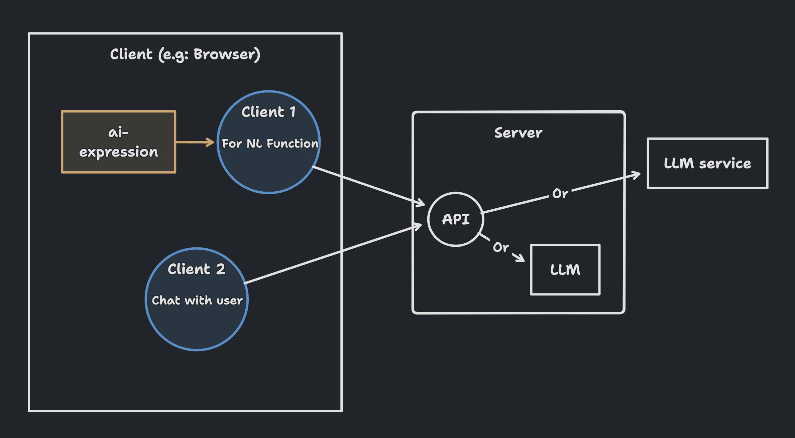

# Recommended Infra
Below is a suggested infrastructure for use with this package. It's just a recommendation.

I will start by presenting an illustrative diagram of the architecture, followed by explanations.

## Place the LLM client on the server
Due to browser performance limitations, LLM is typically run on the server side. Additionally, when interfacing with LLM services like OpenAI, placing it on the server side helps avoid exposing API keys.

Therefore, it is recommended to place the LLM or the client connecting to LLM on the server when using this package.

## Prepare at least 2 clients on the browser side.
You need to have a server API that provides the completion functionality of the LLM. Then, prepare a client to connect to this API.

Considering the use case, I recommend preparing at least two clients:
- One for the `browser-ai` NL function.
- Another for responding to user conversations.

These two clients can have their own LLM parameters (temperature, systemMessage, etc.) to correspond to different scenarios. The NL function for `browser-ai` may request LLM to respond as closely as possible to a given format, so it's advisable to set the temperature to 0.

However, the AI responding to users can be more dynamic. You can try slightly increasing the temperature, and even add character settings for a livelier interaction.